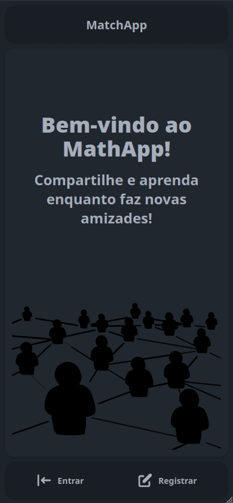
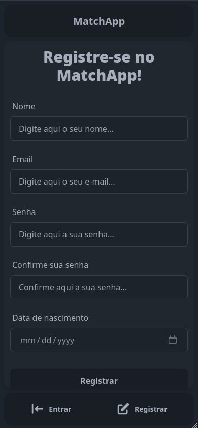
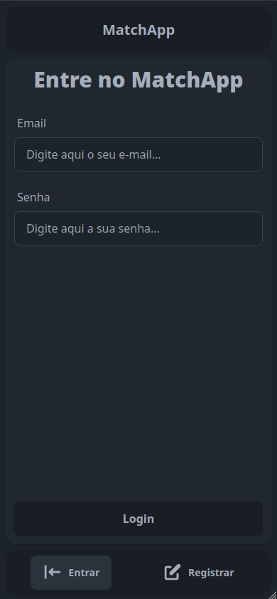
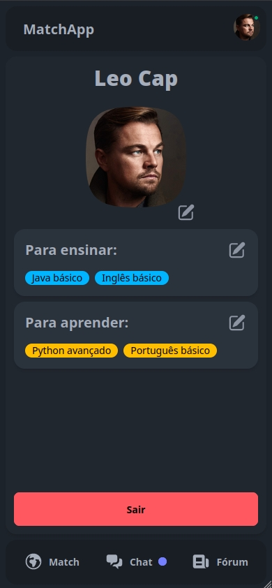
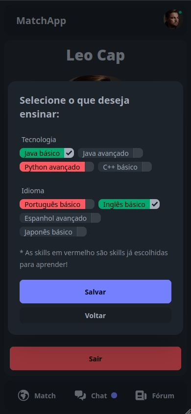
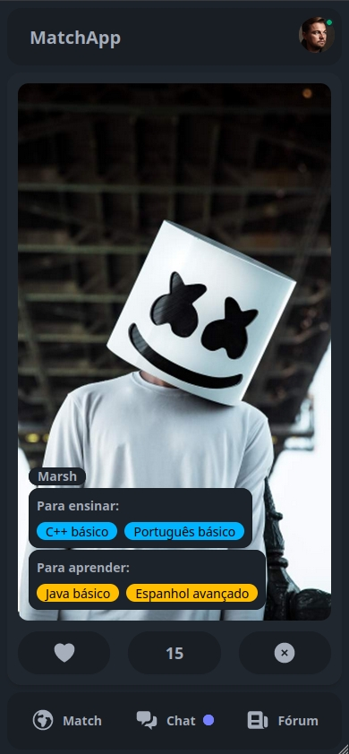
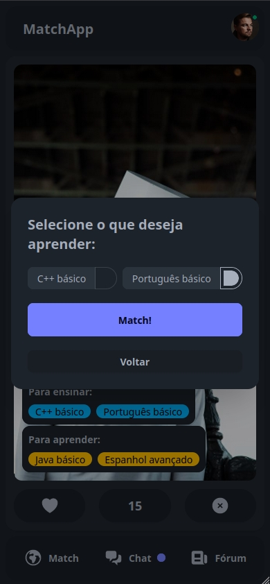
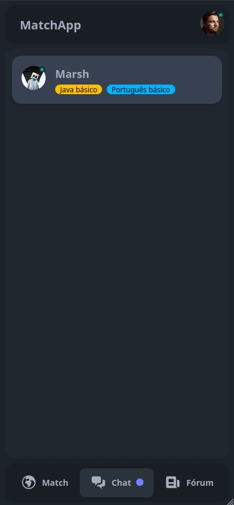

# MatchApp


> Aprenda e ensine com pessoas que compartilham as suas paixões.

MatchApp é um aplicativo web/móvel que funciona como um lugar social para pessoas interessadas em aprender coisas novas
e compartilhar seus conhecimentos.

O aplicativo usa um sistema de correspondência semelhante a alguns aplicativos sociais famosos, como o Tinder ou o
Happn. Os usuários podem se registrar no sistema, inserir informações básicas e escrever brevemente sobre suas
habilidades. Além disso, eles podem expor quais são as coisas que querem aprender.

Depois disso, o usuário pode navegar por uma lista de usuários interessados em aprender suas habilidades e compartilhar
suas habilidades com ele. Quando o usuário encontra alguém, ele pode dar like no perfil enviando uma solicitação para
aprender alguma habilidade. Se o usuário dar um like de volta, é um match! Com um match, o aplicativo disponibiliza os
usuários do match para marcar compromissos para compartilhar o conhecimento entre eles. Os compromissos podem ser por
chat, artigos ou transmissão de vídeo.

## 🎯 Motivação

O projeto foi desenvolvido como parte prática do curso de engenharia da computação da Universidade Jorge Amado. O
desafio proposto era desenvolver um aplicativo utilizando o conhecimento adiquirido durante as aulas de POO (Programação
Orientada a Objetos).

## ✨ Features ✨

- [x] Registro e login de usuários
- [x] Cadastro básico de Skills e Skill Areas
- [x] Edição de perfil (avatar e skills)
- [x] Área de match (like, deslike e match)
- [x] Área de chat com matches (somente lista dos matches)

## 🔨 Em construção 🔨

- [ ] Chat em tempo real com matches
- [ ] Chamada de vídeo em tempo real com matches
- [ ] Fórum interativo entre matches
- [ ] Desfazer matches
- [ ] Descrição do perfil
- [ ] Área administrativa (para cadastros básicos)
- [ ] Menores features...

## 🛠 Tecnologias utilizadas

O projeto usa as seguintes tecnologias:

- Gleek - Para fazer a documentação de UML.
- Figma - Para fazer os sketchs do aplicativo.
- Java Spring Boot - Para fazer a API backend.
- Postgres - Para fazer as tabelas de dados persistentes.
- MongoDb - Para armazenamento de imagens
- Redis - Para controle de sessões
- React - Para fazer um aplicativo web responsivo.

## 📸 Screenshots 📸

<div style="display: flex; flex-direction: row; gap: 5px; flex-wrap: wrap; justify-content: center">
    
    
    
    
    
    
    
    
    
</div>


## 🐳 Como rodar com Docker 🐳

Se você preferir rodar o projeto com Docker em sua máquina, você pode usar o docker compose para
subir rapidamente uma nova instância da aplicação.

#### docker-compose.yml:

```
# Modifique as variáveis conforme o necessário (valores default para localhost)

BACK_PORT=9090
FRONT_PORT=3000
VITE_BASE_URL=http://127.0.0.1:9090
JWT_SECRET=efn40fmufurkf43fi34f # <--- CHANGE!!!!
```

Para rodar o projeto com Docker Compose, abra um terminal na pasta raiz do projeto e digite o
seguinte comando:

> docker-compose up -d

Isso irá construir a imagem do serviço, criar o container e iniciar a aplicação.

Para parar o projeto com Docker Compose, abra um terminal na pasta raiz do projeto e digite o
seguinte comando:

> docker-compose down

Isso irá parar os containers e remover as imagens, redes e volumes criados pelo Docker Compose.

## 📄 Documentação 📄

Ao iniciar a aplicação a documentação das rotas diponíveis do backend fica disponível no endereço:
```http://localhost:9090/docs```

Sinta-se a vontade para explorar as funcionalidades e cadastrar novas skills.

## 🙋🏾‍♂️ Autor

* [Igor Oliveira](https://github.com/reedbluue) - Just another person

## 📝 Licença 📝

Este projeto está licenciado sob a licença Apache - veja o arquivo [LICENSE](./LICENSE) para mais
detalhes.